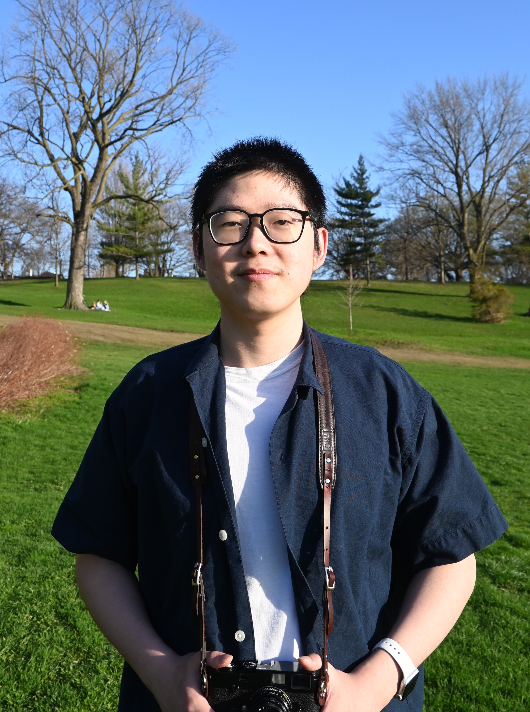

{{}}

Ziheng is a software engineer. He will graduate (or graduated) from University of Toronto in 2023 with a BS in Computer Science. He has worked as a software engineer intern at Meta, Hudson River Trading and Intel.

Ziheng is trying to find a full-time SWE job in either Toronto or anywhere else in the world if visa permits. In his free time, he enjoy researching interesting software technologies and building useful applications.
