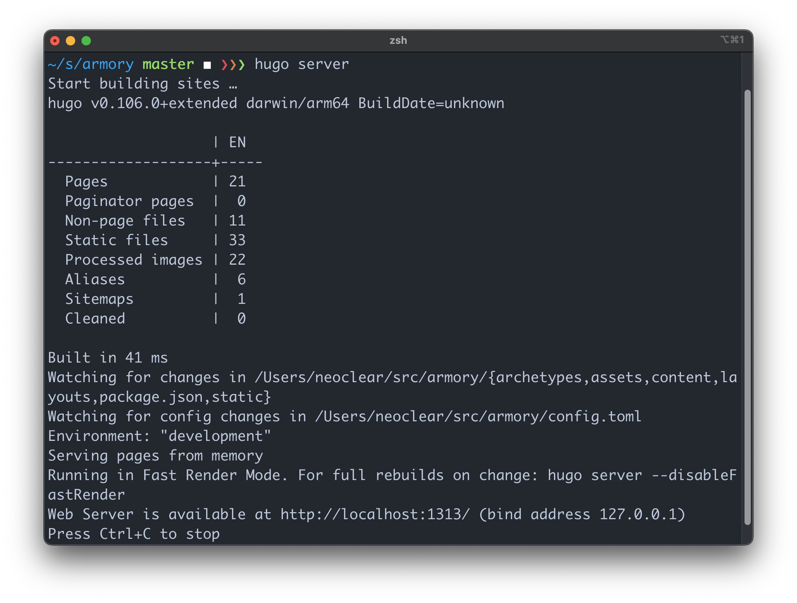

<!-- Linter is getting confused about the asterisks in cron syntax -->
<!-- markdownlint-disable MD037 -->

## [aria2c](https://aria2.github.io/)

aria2c is a tool to download files with any protocols. It supports BitTorrent,
magnet link and many more. It also has a C++ library that allows you to build
tools on top of libaria2.

## firewall-cmd & firewalld

**firewalld** is the daemon process that manages port visibility.
**firewall-cmd** is the command line tool that configures firewalld.

## [Eternal Terminal](https://eternalterminal.dev/)

**et** is a kind of persistent ssh. To set it up properly on the server, you need
to set the port number in _/etc/et.cfg_, and also enable the port number using
**firewall-cmd**. The default port for **et** is 2022.

## systemctl

The command line tool to start/stop/manage daemon process.

## [Fig](https://fig.io/)

A great command line autocomplete tool for mac & iTerm2. Currently it does not
work well on Linux server.

## [Prezto](https://github.com/sorin-ionescu/prezto)

A framework to improve zsh experience.

## tmux

Terminal multiplexter to make a better shell experience. Both iTerm2 & ET
supports integration with **tmux**.

## [hugo](https://gohugo.io/)

A fast framework to build static websites fast. It is suggested over **hexo**
for building blogs.

{{}}

## [fzf](https://github.com/junegunn/fzf)

A framework to easily traverse through command line history.

## [tpm](https://github.com/tmux-plugins/tpm)

tmux plugin manager.

## [tmux-continuum](https://github.com/tmux-plugins/tmux-continuum)

tmux plugin to save and restore tmux sessions on reboot.

## [asciinema](https://asciinema.org/)

Record terminal sessions without barrier.
