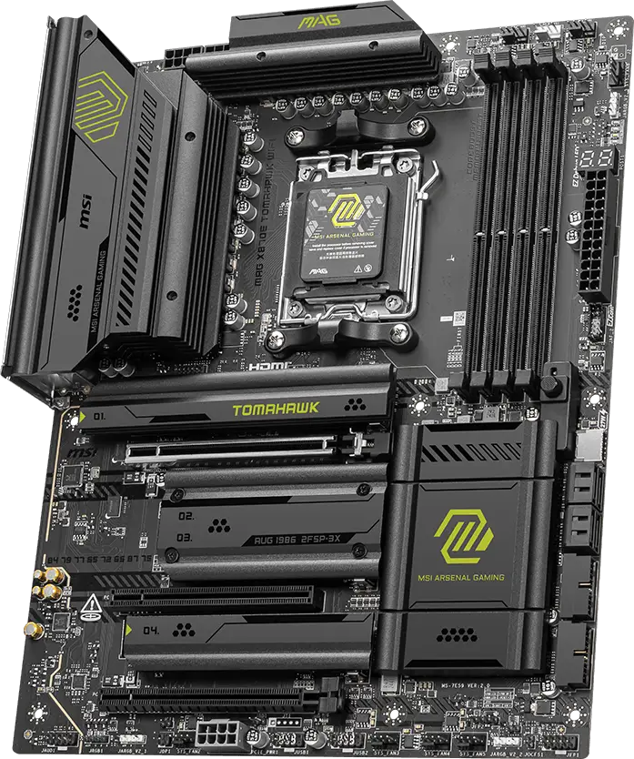
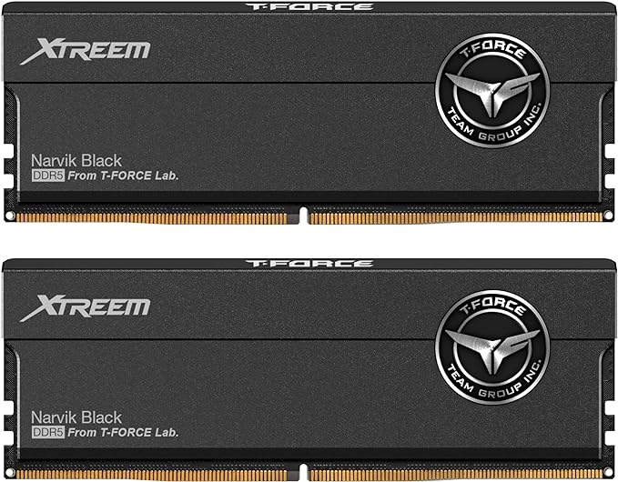

## Intro
After half a year from the first build, I finally have an opportunity to make some upgrades with the income of 5070 Ti. Here's the list:

1. CPU: Ryzen 9 9950X
2. Cooler: Noctua NH-U12A
3. Motherboard: MSI X870E Tomahawk
4. RAM: 24GB * 2 DDR5 8200 MHZ CL38 Teamgroup XTreem
5. New SSD: 990 pro & SK Hynix P41
6. Case fans: 3 * Noctua NF-A14x25 PWM

## Explanation
#### Cooler
An U12A is sufficient to handle a 9950X. It looks nice in its compact form. Might lose some performance compared to an AIO, but it lasts longer.
#### Motherboard
Tomahawk has the best quality among competitors within the same price range. I considered about ProArt X870E, but it's Q-release technology would damage the GPU.

#### RAM
Best Hynix A-die. Proved to be performant.

#### Case fans
Noctua fans are no-brainer.
