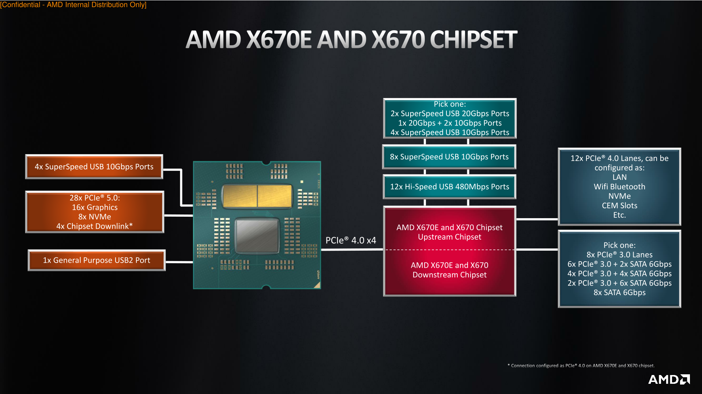
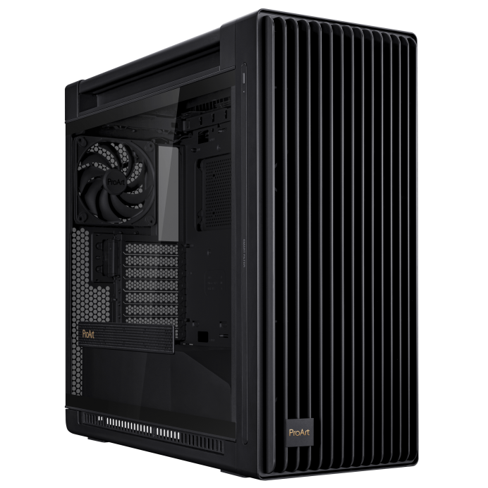
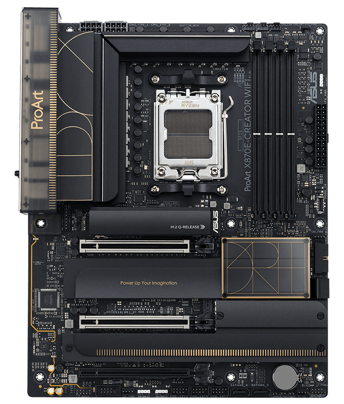

## Introduction
Dual booting allows you to have both Windows and Linux installed on the same computer, giving you the flexibility to choose which operating system to use when you start your machine. Surely you may choose to use only one machine. However, how do you game on a Linux computer and how do you write programs properly on Windows? The other alternative is to use a virtual machine, but this route is not "clean" to me. As always, I prefer an OS running on physical hardware to achieve the best performance.

Some of you might think of triple booting, as Hackintosh is also a good choice. To me, macOS runs the best on a real Mac, thus I would not consider running macOS on a non-Apple computer. As a personal reference, I would only dual-boot into both Linux and Windows.

For this guide, I would walk through a few booting and partitioning strategies and hardware capabilities that achives the cleanest dual-booting experience.

## CPU PCIe lanes
Normally CPU would have only one direct PCIe x4 lane provided to the drive, and all other SSDs are connected through chipset extension, which incurs extra latency. Normally transmittion through chipset is not a bit problem, and it does not reduce sequential IO ops. However, 4K performance are impacted by around 20%. Most importantly, adding OS drive through chipset is NOT "mentally clean" to some people (obviously, including me). Thus, you either put both OS into the same drive, or buy a motherboard and CPU with two direct SSD interfaces. Currently Ryzen 7000 & 9000 series has 28 PCIe lanes, and there remains 8 PCIe lanes for SSDs after using 16 lanes for GPU and 4 lanes for chipset.

(This is not writing a academic paper, so I would not put effort into citation & stuffs. Just be mindful that almost all pictures are taken from the internet)

For X670 and AMD Ryzen 7000/9000 series, CPU provides 28 lanes as explained above. Most high end motherboards provide 2 SSDs with direct connection.

The predecessor of X670, on the other hand, provides only 1 direct SSD connection. What happened? Well, for some reason AMD decides to distribute PCIe x4 as dedicated channel for USB4 port, reducing direct SSD ports from 2 to 1. Yes, you are right, AMD is using PCIe gen 5 as gen 4 just for USB4. It is so ammusing. In this case, if you were to install two SSDs on X870 motherboards in direct connection, it would take additional x4 lanes from the second PCIe slot, resulting PCIe x8 gen 5 mode for the primary GPU. This is allowed, however, as the most high end GPU for the next generation might not take full bandwidth of PCIe x8 gen 5.

> AMD Ryzen™ 9000 & 8000 & 7000 Series Desktop Processors*\
> 2 x PCIe 5.0 x16 slots (support x16 or x8/x8 modes)**\
> AMD X870E Chipset\
> 1 x PCIe 4.0 x16 slot (supports x4 mode)\
> \* Please check the PCIe bifurcation table on the support site (https://www.asus.com/support/FAQ/1037507/).\
> \** PCIEX16(G5)_2 shares bandwidth with M.2_2 slot.\
> \- To ensure compatibility of the device installed, please refer to\
> https://www.asus.com/support/ for the list of supported  peripherals.

If you really do not want to split PCIe lanes for your GPU, your choice becomes either: 1. Use X670 motherboard or; 2. Put both OS into the same drive.

Now let's consider dual-booting from the same drive.

## Boot Loading
How do you want during the boot process? A nice GUI boot menu listing all bootable OSs? Or just a simple TUI menu with bootable kernels? For me, I prefer the latter option.

First, let's talk about installation order. Please install Linux after Windows, as the latest boot loader would be defaulted in BIOS. Also, Linux installer would automatically generate Windows boot menu item for its boot loader, making a nicely curated TUI boot loader for grub2. Alternatively, you may choose third-party boot loader programs, including: rEFInd, systemd-boot, opencore. Opencore is specifically designed to boot Hackintosh, but it is also capable of booting both Linux and Windows. You may install them as alternative options.

Some may heard of Windows updates contaminates Linux boot loader. Well, that should not be a problem for disk partitions based on UEFI. It means modern computers should not worry about it.

## Partition
Well, partition in whatever way you like. Just for Linux, you might wanna assign different partitions manually for different mount points. You need to assign `/boot/efi`, `swap` and `/`. You may also alternatively assign a partition, or even an entire disk for `/home`, securing your data across installations. I wish Windows could have similar functionalities for their home directory, but it is not possible due to OS limitation :(.

## My Strategy
After discussion relevant topics about dual-boot, we finally arrive at the section introducing my strategies and ideologies about building a maintainable and easy-to-use machine.

### Case
Well, my dream PC has an ATX compatible case, maximizing the compatibility and configurability. Currently I am looking at PA602, a nicely designed case with awesome cable and air duct management. It also prebuilt with full fan support, and leave the top for 420mm AIO. Despite its price, it is still an awesome PC case, and I would like to replace my meshlicious ITX case with it.

### Motherboard

Would you go for Intel products after their 13/14 gen issue? For me, probably not. However, if they prove their 15th gen processors fixes the problem, I might still put Intel into consideration. For now, let's consider only AMD platforms.

Despite the fact that X870 has one direct SSD connection less than X670, I might still vote for X870. A few reasons: 1. X870 is newer, thus it is more mentally clean. 2. Despite providing only PCIe gen 5 x8 for GPU with 2 SSDs connected to CPU directly, the bandwidth is still sufficient for most all GPUs, including the unreleased RTX 5090.

### Disk Partition Strategy

First, I would never connect bootable drives to chipset. Choosing between 2 separate SSDs or just one for 2 OSs, I would go for only 1 SSD. First, I might continue using my Z690I for an extended period of time, meaning only one SSD could be connected to the CPU. Second, only one SSD would be accessed at any given time, and putting them to two SSDs does not utilize the bandwidth to its maximum capability.

I would not reiterate on partition strategy for two OSs, as I already covered them above.

Another important thing to cover is data backup strategy. To avoid data loss on SSD failure, which is a common thing, you should really backup important data. Here are few strategies:

1. Clone the state of disk partitions. This method is not preferred, as it is overly complicated.
2. Manually rsync data you want. Personally I prefer this method, as it is really simple. The downside is the lack of versioning control.
3. Use backup softwares like Arq or Vorta/Borg. They support version control, but they either cost you money, or use its custom format to store backups. At the end of the day, I only trust Time Machine for macOS backups.

Most motherboards support at least 2 nvme ports for SSD installation. Thus, just put the backup SSD into the second port and make copies whenever available.

### Incremental Updates

You will never arrive at the best solution in one step, and you always need to upgrade your personal hardware at some point, now or in the future. A good strategy is to plan your updates accordingly, and swap out different components each time, instead of doing a complete update. Just like incremental GC for amortized performance right?

1. Carefully plan your update strategy, make sure some components are compatible with future upgrades. For example, an RTX 5090 could survive across motherboard updates, and a SSD could survive motherboard replacements.
2. Do research before you make purchase decision.
3. Make sure your components are maintainable. For example, do not choose system water cooling, as it is hard to maintain.

### Cable Management
Default cables are hard to bend, thus choosing custom cables is ideal.
