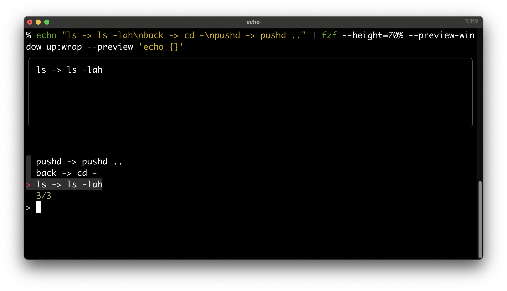
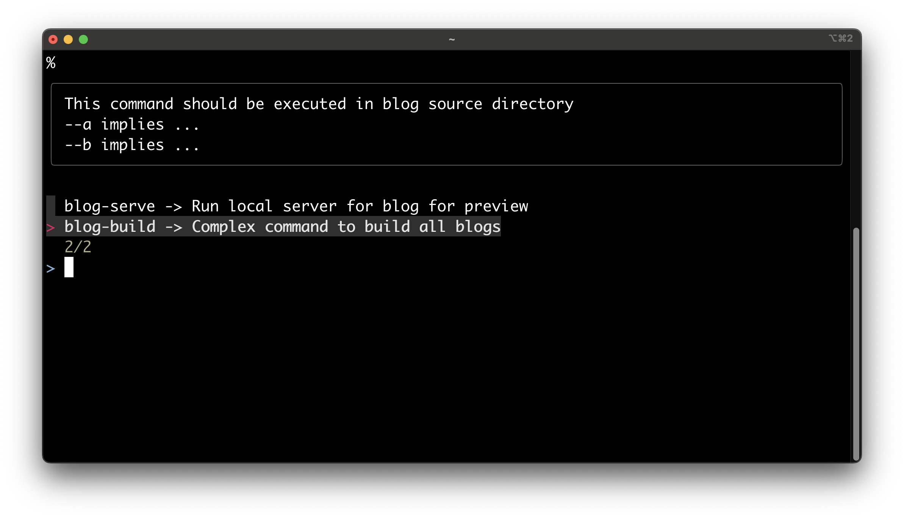

<!-- Linter is getting confused about the asterisks in cron syntax -->
<!-- markdownlint-disable MD037 -->

## Dotfiles & Aliases Are Not Enough

Some engineers would keep some dotfiles with aliases for shortcuts; They thought it would make things faster. But things aren't that promising when configuration gets larger. No engineer can remember the exact alias for a certain command, and no engineer can remember the command for a certain alias. They need query features to help them, and this is why my project comes to life.

## Expectations For The Project

What dotfiles lack is the ability to query useful information. For useful information, we expect:

1. Able to auto-complete the command based on command alias. For example, there are two complex commands with aliases `blog-build` and `blog-run`, the tool should show both aliases when I type `blog`.
2. Able to show description of several useful options about the command. The description can also contain useful usage information for the command, like where the command should be executed or prerequisites of the command.

## Utilize Existing Softwares For The Project

To build an auto-completion tool with nice UI takes time and effort. As no one should waste a year to build a assistance tool that only optimizes a certain section of the dev workflow, I decided to utilize `fuzzy finder` for my project.

`fuzzy finder` is used to auto-complete shell history with fantastic UI. It provides a preview mode to preview on each line via `--preview '<preview_string_generation_command>'`. The most exciting thing about this software is that the tool takes completion lines from stdin. It means I do not have to modify any part of `fzf` to implement my project!

{{}}

## Design Of The Tool

The tool should store a json file that maps each alias to command and description. On query mode, the tool takes in the alias and outputs the command and description. There should another shell script that glues the IO of the tool and `fzf` together to make everything work. An example of the glued script would be:

```zsh
# The command outputs all aliases and redirects it to fzf.
# fzf previews each line by calling the tool again for description
icache list | fzf --height=50% --preview \
'icache describe $(echo {} | sed "s/ -> .*//")' --preview-window up:wrap
```

Next, just use give the script a key binding (like `CTRL-F`), and engineers can complete their complex commands by a simple key press. To update aliases, simply edit json configuration file

{{}}

## Source Code

The source code is not open-sourced, as it is very simple. Anyone has the right idea can implement it in several hours.
