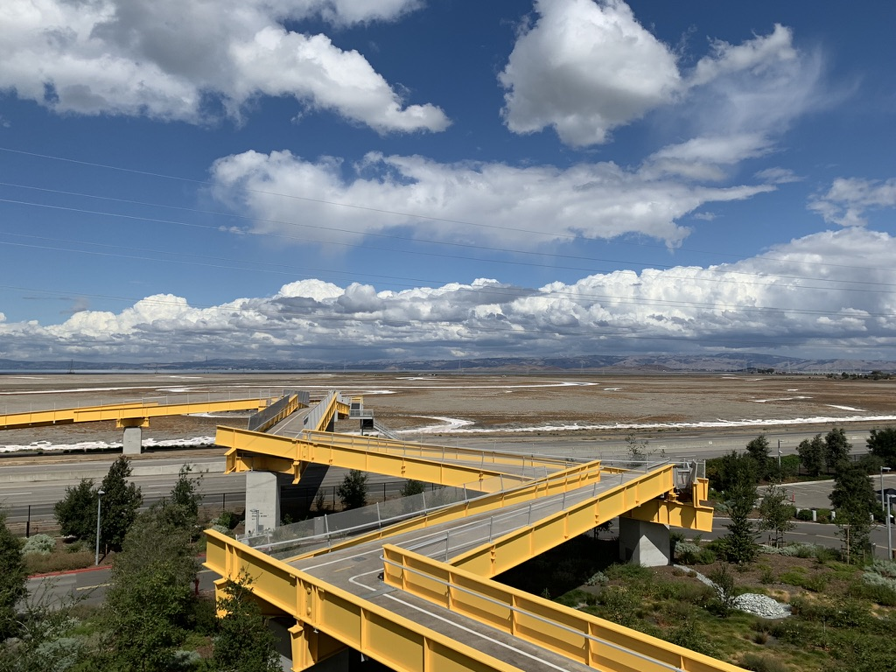
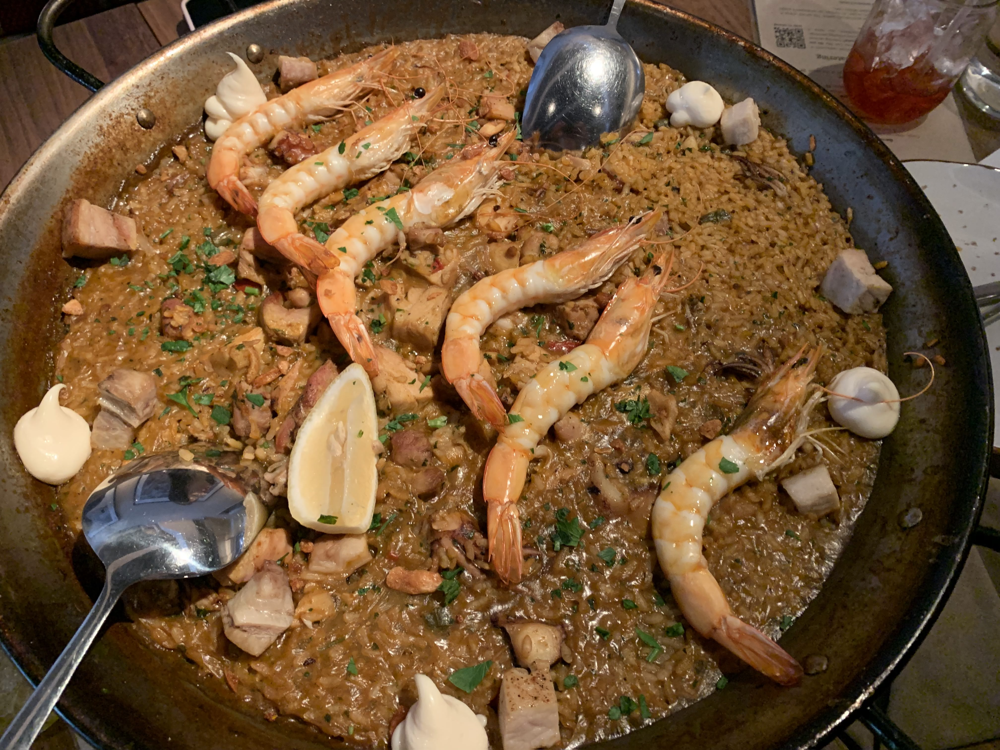
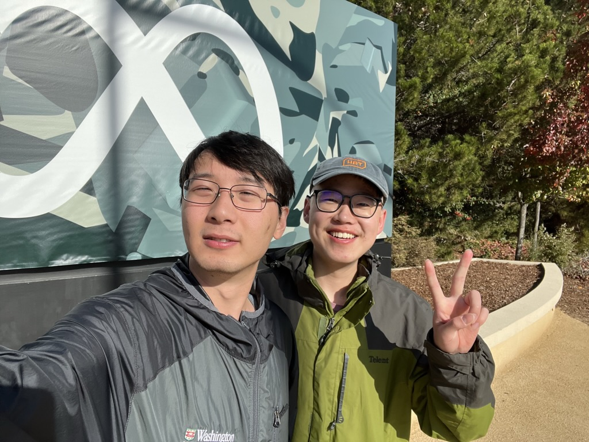

<!-- Linter is getting confused about the asterisks in cron syntax -->
<!-- markdownlint-disable MD037 -->

## Prologue

Tech job market was hot last year (by last year I mean end of 2021), and most
tech giants expanded their hiring plan. I applied to Facebook, went through
all interviews. That's it!

Also, Meta moved me to California just for a 12-week internship. California is
warm (relatively) all year, and I really like the weather there! This
internship is probably the only chance to visit Silicon Valley in several
years.

## Internship Overview

During the internship, I had the opportunity to work with talented engineers in
Facebook search team, go through the infrastructure behind tremendous search
functionality and improve the quality of it. It is my first time working on such
a large service, where any small change could impact large user scale. To make
the system development robust, Meta built a series of internal toolings to
deploy, test and monitor search correctness and quality, and these internal
tools are more complex than products from some smaller companies.

{{}}

## Internal Tooling

Tooling is simple when development team is small. One can easily set local
testing tool and manually setup development machines when team is small.
However, things gets trickier when engineering team grows. It would be a pain
to let every new engineers to manually setup the development machine, and a
pain for every engineer to know how testing framework works as a whole.

Properly-organized tech companies have a set of internal tooling to do resource
management, task scheduling and data processing. Just to name a few, Google has
internal cluster management system called Borg to manage thousands of servers.

Compared to product engineering, internal tooling's customers are engineers.
Also, internal toolings focus more on core infrastructure instead of product,
thus it is more engineering-heavy than product softwares, and requires cleaner
code than speed, as these tools are supposed to last long.

## Employee Perks

Facebook (I prefer to call it) is famous for its great perks for employees. The
company provides free shower and team offsite perks. I still remember the team
offsite with teammates in a restaurant enjoying king crab. The company has a
MPK classic park in the MPK campus, where barbecue and ice creams are provided.
Unfortunately I didn't discover this place until 2 days before my last day :(

{{}}

## Learnings

1. **Take the opportunity to learn something useful:** During the internship,
   my teammates & managers guided me through Meta's huge internal system &
   facebook search ranking design. This gives me an understanding of how
   internal infrastructure should look like, and how to design a ranking
   system.
2. **Reach out to people:** Internships aren't just about return offers, they
   are about precious time to experience and reach out to people. Always
   take some time off to connect with other interns & fulltime engineers.
   You'll find something valuable from the communication.
3. **Enjoy offsite times:** Find peer interns & friends to hang out on
   weekends! The internship is probably the only time to visit California in
   several years, so do not just fill your time with work!

## Epilogue

This internship is a great experience for me overall. I built connections with
my teammates and get the chance to visit California. Meta paused its hiring
for new engineers (especially new grads), so I am not looking for a return
offer. But the 12 weeks spent at MPK is still precious!

{{}}
