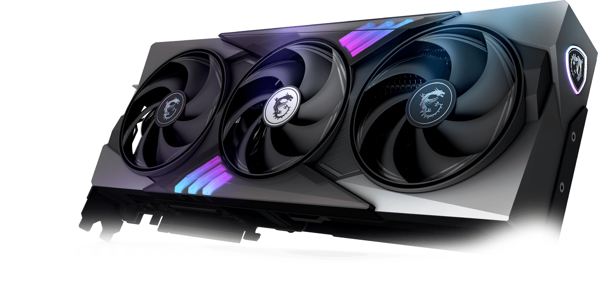

> Accomplishments come with pain. Well, not always true: you might suffer without achievements

### Background
AMD GPUs have been a great choice for Linux users. It offers great compatibility & open-source drivers. I've had a good time playing around with AMD GPUs in both Linux & Windows. However, Nvidia still leads in AI capabilities, and I had no choice but to buy a Nvidia GPU for AI projects. Hence, I bought a RTX 5070 Ti.

### The Right Installation
AMD GPUs runs out of the box on Linux. Nvidia GPUs, on the other hand, requires sophisticated setup process. I ended up fresh-installed Fedora 41 just to get Nvidia drivers working.
The trick of the setup is to install driver properly. The thing is, Nvidia official drivers **DOES NOT WORK**. Can you imagine following instructions on an official website and they are wrong? That's true for Nvidia GPU setup on Linux.

Some useful guides
- https://discussion.fedoraproject.org/t/correct-walkthru-for-nvidia-drivers-on-fedora-41-gnome/136159
- https://rpmfusion.org/Howto/NVIDIA

The right way to install Nvidia drivers
```sh
sudo dnf update -y # and reboot if you are not on the latest kernel
sudo dnf install akmod-nvidia # rhel/centos users can use kmod-nvidia instead
sudo dnf install xorg-x11-drv-nvidia-cuda #optional for cuda/nvdec/nvenc support
```

The above instrution might not work for new GPUs. Consider below instructions from [fedora project](https://discussion.fedoraproject.org/t/nvidia-driver-not-loading-after-switching-gpu-failed-to-allocate-nvkmskapidevice/147114/3)
```sh
sudo sh -c 'echo "%_with_kmod_nvidia_open 1" > /etc/rpm/macros.nvidia-kmod'
sudo akmods --kernels $(uname -r) --rebuild
```

You do not want to install `akmod-nvidia-open` per below:
> I don’t recommend using the akmod-nvidia-open package, the code isn’t the same as the kernel-open code in xorg-x11-drv-nvidia-kmodsrc package.
Also akmod-nvidia-open has dependency issues that I have no easy fix for, it’s a shame rpmfusion infra can’t handle rpm boolean requires :frowning:

How to check if drivers have been installed properly? Perform a full reboot and a correct 4k resolution would tell you. In retro, I should have avoided a reinstall by following the right instructions.

### Issues with Fedora 41
Nothing bad about it. My only complaint is about the removal of Xorg from fedora. The setup of i3 will not work without Xorg. Here's the command to fix:
```
sudo dnf install xorg-x11-server-Xorg.x86_64 xorg-x11-server-common.x86_64
```
The credit belongs to some random reddit users [here](https://www.reddit.com/r/Fedora/comments/1htaahg/new_i3_wm_option_doesnt_appear_in_lock_screen/)

Sway simply does not work on Nvidia proprietary drivers. It might work on Nouveau drivers, but I am too scared to try it out.

With all the above instructions, Nvidia GPUs run on Linux could provide both proper GUI & AI capabilities.

Btw, this is what I've got:


