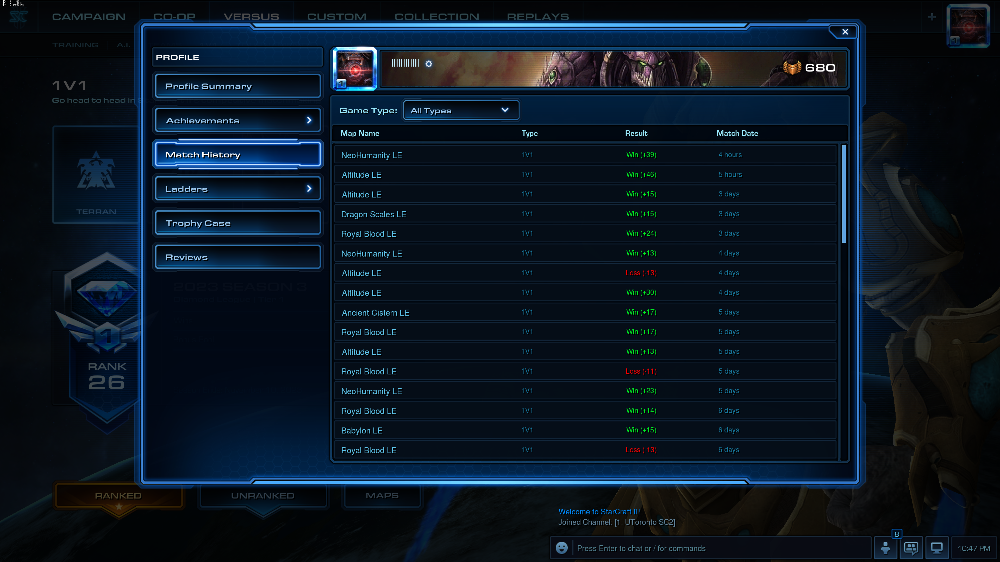
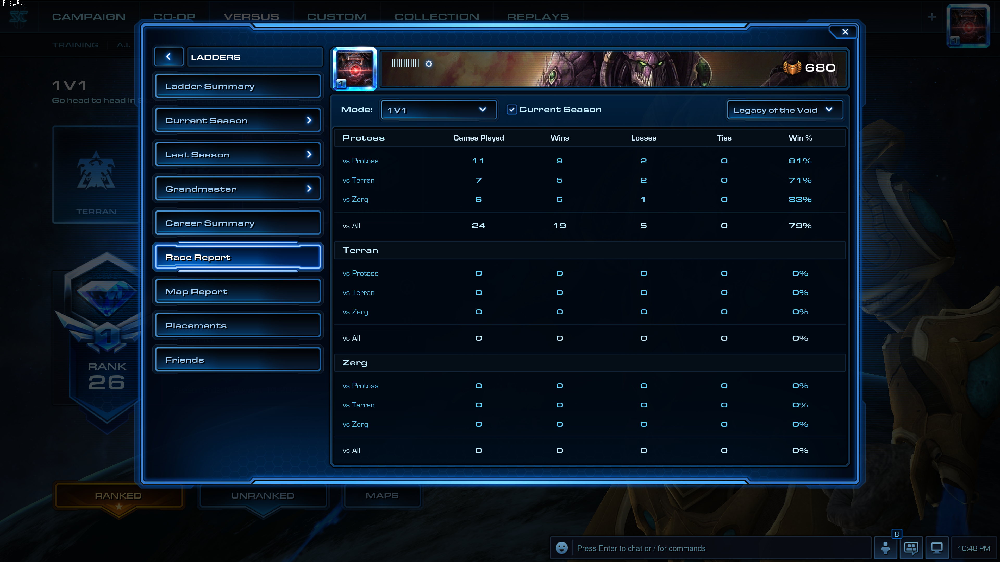

<!-- Linter is getting confused about the asterisks in cron syntax -->
<!-- markdownlint-disable MD037 -->

## Guide To Victory

StarCraft 2 is interesting; this statement is quite self-explanatory. Also, this
game requires careful planning and execution to win: no players could win
without clear strategies. In this post I would go over my current findings for
protoss in StarCraft 2 games. Before we dive into the tutorial, let us check my
recent achievements :)

{{}}
{{}}

## General Guideline & Personal Style

Some protoss players prefer 2 base strategies, and they have been successful.
Personally I prefer not to execute 2 base strategies, as good scouting would
easily stop that. Also, I prefer to invest in upgrades and eco first, and I tend
to have less army than my opponent. Thus, in my recent gameplays I always find
my self having a bunch of probes and 7 bases, with little army LOL. Also, I keep
good habits controlling maps, always put several zealots or probes or pylons to
keep my vision on the whole map, so that I know when and where my opponent would
appear. This is not true for PvZ, you know why.

Since I have less army, how do I stay up with the game? The key is through
static defence structures. Each time my opponent trys to engage with me around
my base, I would have batteries and cannons to stay up. In this way, I could
keep up with relatively less army and continue my investments in upgrades and
gas units. Against three matching, I would double upgrade ground units, so I
often find my units way ahead in strengths, especially in PvP.

Also, I am a big fan of zealot & DT runby. Having a second group of fast and
cheap units makes it really easy to counter-attack and drag opponents back. I
also intetionally initiate counter-attack when my opponent is about to start
their fight around my bases. It makes them a lot harder to handle these runbies,
thus does great damage to their eco.

Also, make good use of prism. It is a really good unit to throw tens of zealots
into enemy's base in seconds. Do it when your opponent is about to attack, same
as zealot runbies.

Also, I find it stupid to turn into careers in late games. Usually you would
face a sudden death, especially in PvP. One reason is that ground units are
fully upgraded, while careers are only on +1.

### TLDR

1. Do good scouting. Utilize sentry, oracle or even probe.
2. Fast upgrade.
3. Expand faster than your opponent, but do not over-expand.
4. Do zealot & DT runby.
5. Make use of prism.
6. Do counter-attack when your opponent is about to engage.
7. Analyze and predict what your opponent would do.

Above are general guidelines, but for each race details vary a lot. I will cover
those in following sections.
