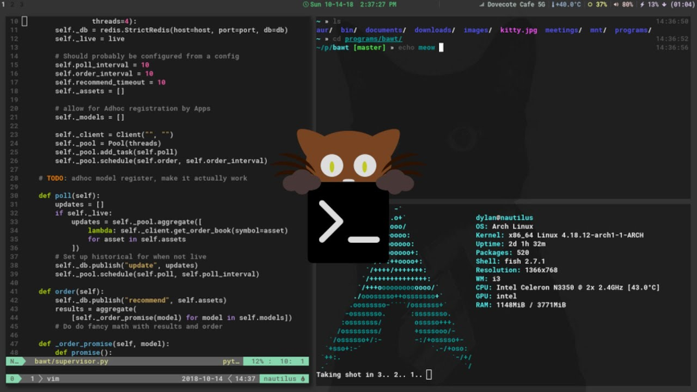
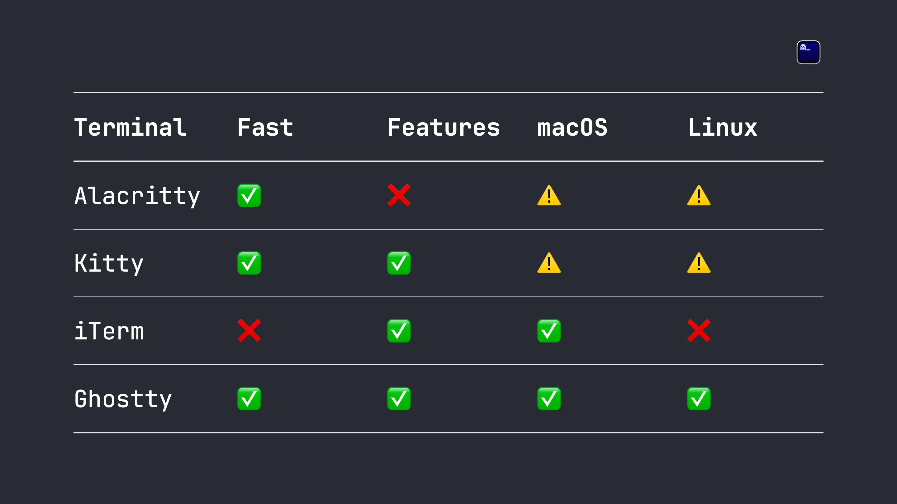

## Why Do We Care About Terminal Emulators?
I was as indifferent to terminal emulators as you: aren't they just wrapper applications for the shell with slightly different functionalities? I did not realize this mistake until I came across the blog post from [Mitchell Hashimoto](https://mitchellh.com/writing/ghostty-devlog-006). This post mentioned the speed/feature-rich difference between available terminal emulators. Terminal emulators could leverage SIMD CPU instructions to speed up various tasks, and make UI more efficient through GPU rendering. After trying out a bunch of them, I've partially built up my preference list

### Alacritty
Built in Rust and rendered in OpenGL, Alacritty delivers impressive speed with sufficient features. It is my daily driver on Linux. However, Alacritty lacks native tab support, and is missing features like correct glyph rendering on macOS. Alacritty is written in Rust, which is a plus for me.

### Kitty
The most feature-rich terminal emulator I've ever used. It supports anything that you can imagine. Kitty is developed in Python and C, but it runs faster than Alacritty on macOS, despite being slower on Linux. It delivers similar UI experience to my default Alacritty configuration, so I've just switched to Kitty on macOS. Python + C looks ugly to me, but I care more about features and performance than the language it's written in.

### WezTerm
Written in Rust, Wezterm is another feature-rich terminal emulator. However, it runs slower than Alacritty and Kitty despite being written in Rust. Also, the UI looks different despite having the same theme and font configuration, which is a deal-breaker for me.

### iTerm2
I used to like on for my macOS development for its rich feature set, and its popularity among Mac users. However, it is slow (that is important). Thus, I've abandoned it in favor of Kitty.

### Ghostty
The best. Built by an 100x engineer, used Zig programming language and native UI integration on both macOS and Linux, adopted SIMD instructions and better algorithms, Ghostty delivers the union of all pros from any other terminal emulators. It is native, feature-rich, fast, cross-platform, and beautiful. However, it is still in closed beta, so I cannot use it yet. Hopefully it would be accessible by the end of 2024.

### Konsole, GNOME Terminal, macOS Terminal, etc.
No proper engineer should use these garbage. (disclaimer: I'm joking)

## My Preference
I am talking about my preference as of 2024 October. I use Alacritty on Linux and Kitty on macOS. Kitty is chosen for macOS because it is feature-rich and faster than Alacritty on macOS. Alacritty is picked for Linux because it suits into my i3wm workflow and is faster than Kitty on Linux while delivering sufficient features.

I would switch to Ghostty once it is available. Really looking forward to it.

## Disclaimer
All pictures in this blog are from someone else on the internet. I do not own any of them. Please contact me if you are not comfortable with me using your pictures.
